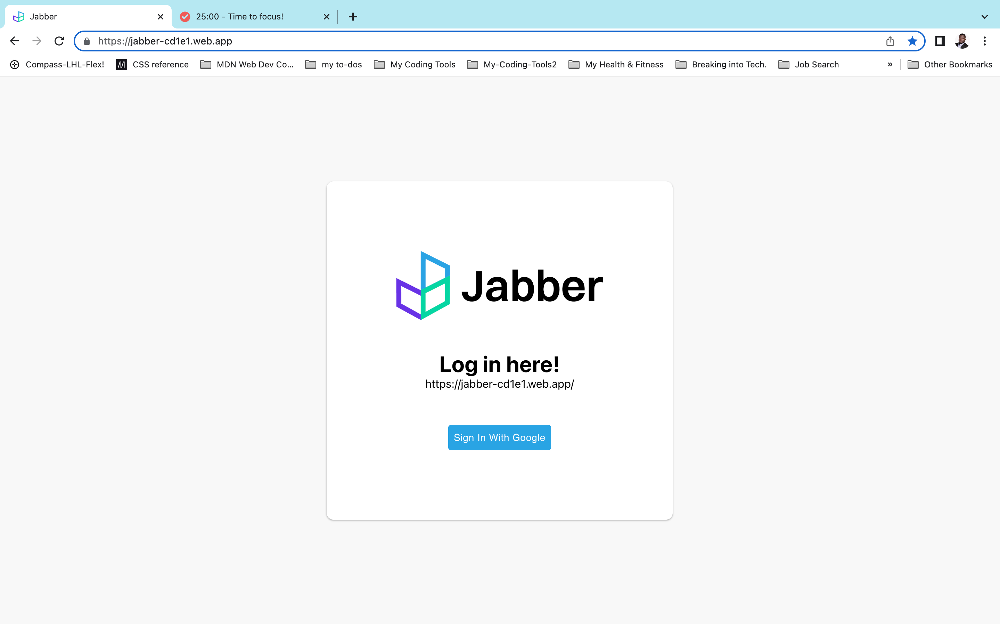
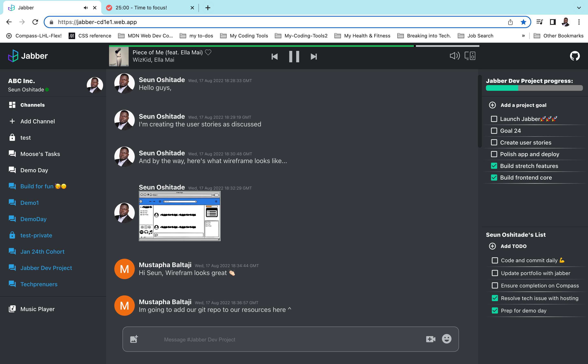
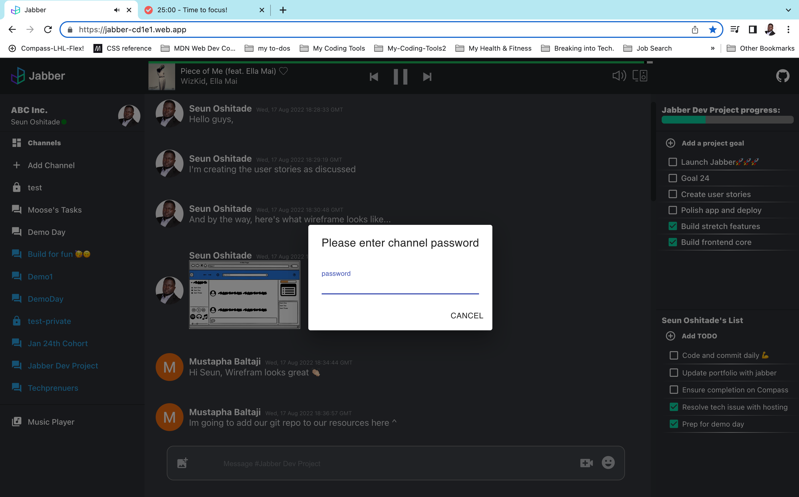
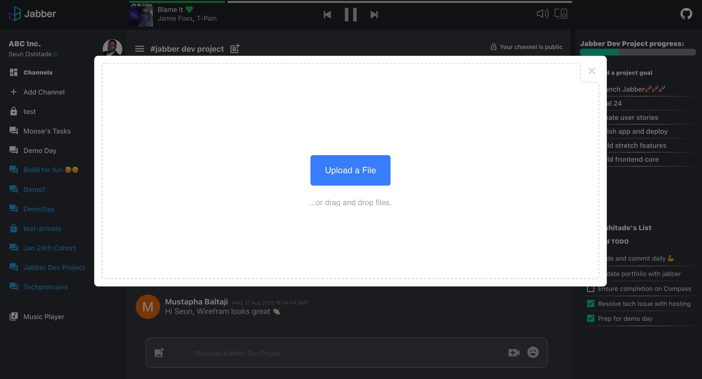

# JABBER Project

This project is a React app that was completed by [Dino Pranjic](https://github.com/DinoPranjic), [Mustapha Baltalji](https://github.com/mbbaltaji) and [Seun Oshitade](https://www.linkedin.com/in/seun-oshitade/). It presented an opportunity to learn new technologies and build a product in a collaborative and projectized environment.

## About

Inpsired by popular messaging apps like [Slack](https://slack.com/) and [Discord](https://discord.com/), Jabber is a feature-rich messaging app. We set out to build a multi-user chat platform which includes features that could enhance personal and group/project productivity, with some elements of personalized entertainment. 

## Tech Stack
* Frontend: React, Redux, Styled Components, Firebase Authentication, Material UI
* Backend: Node, Express, Firebase Store
* API Intergations: Video Chat, Spotify Music, React Uploader  

## Features
* Secured user login (OAuth)
* Text chat with optional private chat feature
* Video Chat with complete set of related features
* Spotify login with personalized playlist per loggedIn user
* Project tracker, mapped to each chat room
* Personal todo list, mapped to each loggedin user
* Image drag and drop for sharing images/ screen shots
* A Resources feature for storing urls relating to respective projects

## Live Demo
You can access the live demo [here](https://jabber-cd1e1.web.app/). The app is currently set up for standard-size/ large screen views. Mobile and touchscreen views will be supported subsequent versions.

## Screenshots
* Login

* Overview

* Private Channel

* Drag-and-drop file

## Dependencies

  * @material-ui/core
  * @material-ui/icons
  * @reduxjs/toolkit
  * emoji-picker-react
  * firebase
  * react
  * react-dom
  * react-firebase-hooks
  * react-redux
  * react-router-dom
  * react-scripts
  * react-spinkit
  * react-spotify-web-playback
  * react-uploader
  * styled-components

## Continuous Improvement
Future iterations of Jabber will include the following developments:
* Ability to register organizations for dedicated instances of the app
* Responsive view on all screen sizes
* Fuzzy search and additional features that will leverage on the fuzzy search feature

The above list is not exhaustive.

## Usage
Access [Jabber](https://jabber-cd1e1.web.app/) from your desktop your desktop at https://jabber-cd1e1.web.app/. Sign in securely with your Google account and explore the features. This version of the app is optimized for full screen view. The music player is accessible only to premium users of Spotify.

## License
Selected aspects of this project may be subject to intellectual property rights.